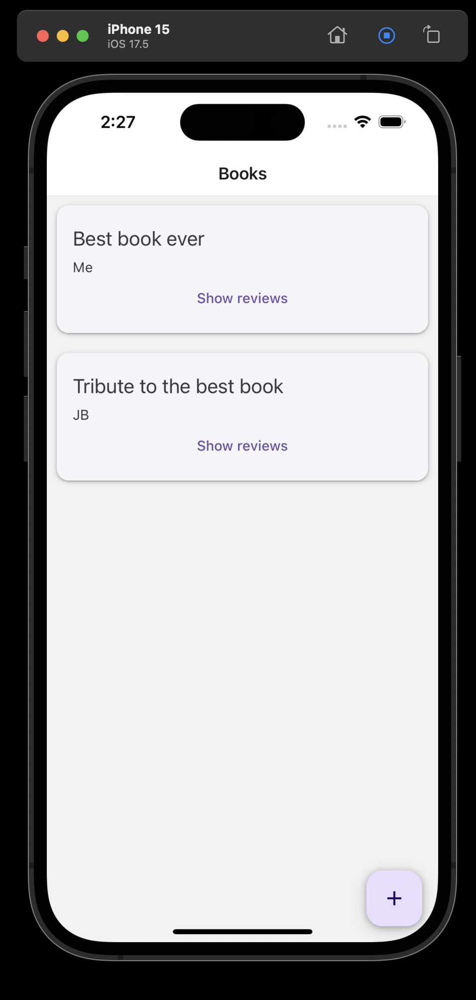

# Book Review - Expo

LIVE DEMO! <https://jackmckew.github.io/expo-book-review/>

## Technology Stack

- Expo with React Native using Typescript for Front end (iOS, Android and Web)
- Supabase with PostgreSQL for our API & Database
- Jest for testing

## Install & Run

1. Clone this repo
2. Navigate into the folder`cd book-review`
3. Install via npm `npm install`
4. Run via expo `npx expo start`

## Expo Simulator

If you've got XCode installed correctly, expo should allow you to run in the simulator out of the box!

